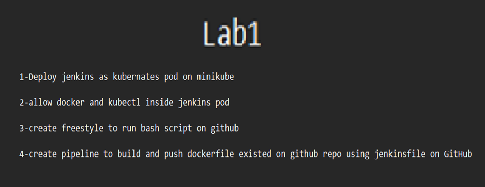
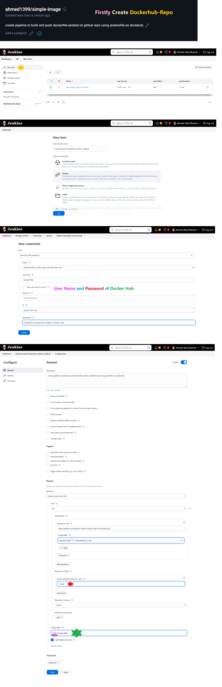

# Steps to implement Lab1


## 1. inside Dockerfile_Deploy
```bash
# containes Dockerfile   &   jenkins-deployment.yaml 
```
### a. Create a Custom Jenkins Docker Image through Dockerfile
```bash
# to Allow docker and kubectl inside jenkins pod

docker build -t my-custom-jenkins:latest .
docker tag my-custom-jenkins:latest <your-dockerhub-username>/my-custom-jenkins:latest
# to test Image before Push it to Dockerhub
docker run -d --name <container-name> <my-custom-jenkins:latest>
ocker exec -it <container_name> bash
docker --version
kubectl version --client 

# if all ok push your Image to use it inside "mainfest"
docker push <your-dockerhub-username>/my-custom-jenkins:latest 
```
### b. jenkins-deployment.yaml
```bash
# Deploy jenkins as kubernates pod on minikube 
# After install minikube on Desktop
            https://github.com/kubernetes/minikube/releases
            # install minikube-installer.exe
            # to Start K8S
            minikube start
# Create New_Namespace
kubectl create new namespace <your-name>
# Display all Namespace
kubectl get namespace

# to Deploy jenkins as kubernates pod on minikube 
kubectl apply -f <manifest.yml> -n <your-namespace>

kubectl get pods -n <your-namespace>
# After Pod created check to to ensure that Docker and Kubectl Installed 
kubectl exec -it <jenkins-pod-name> -n jenkins -- /bin/bash
 docker --version
 kubectl version --client

minikube service <your-service> -n <your-namespace> --url
# Take URL to the Browser to appear Jenkins Page
# will appear "Enter Password"

# to display Password 
# Display Pod_Name
kubectl get pods -n <your-namespace>
# to Enter to the "Container>
kubectl exec -it <pod-name> -n jenkins -- /bin/bash
# Display Password
cat /var/jenkins_home/secrets/initialAdminPassword

```
## 2. create freestyle to run bash script on github
```bash
# Deploy jenkins as kubernates pod on minikube
kubectl get pods -n <your-namespace>
# to Enter to the "Container>
kubectl exec -it <pod-name> -n jenkins -- /bin/bash
# Display Password
cat /var/jenkins_home/secrets/initialAdminPassword

```

# 3. Create a Freestyle Job to Run a Bash Script on GitHub
```bash
- Log in to Jenkins and click on New Item.

- Enter a name for the job, select Freestyle project, and click OK.

- Under Source Code Management, select Git and provide the repository URL.

- Under Build, click Add build step and select Execute shell.
```
## Architecture


# 4-create pipeline to build and push dockerfile existed on github repo using jenkinsfile on dockerhub
```bash
- Enter a name for your pipeline (e.g., Docker-Build-Push).

- Select Pipeline and click OK.

- Under the Pipeline section:

- Select Pipeline script from SCM.

- Choose Git as the SCM.

- Enter your GitHub <repository URL> .

- Specify the branch (e.g., main).

- Set the script path to Jenkinsfile (if it’s in the root of your repo).

- Click Save.
# Finally
- Run Build
```

## Architecture


## Output




## [ Global Variable ] localhost:8080/env-vars.html/   ##################